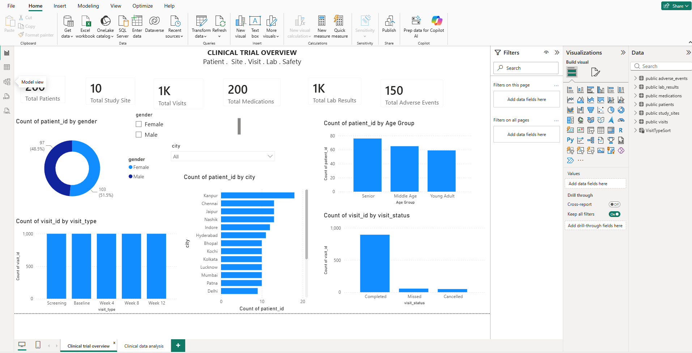
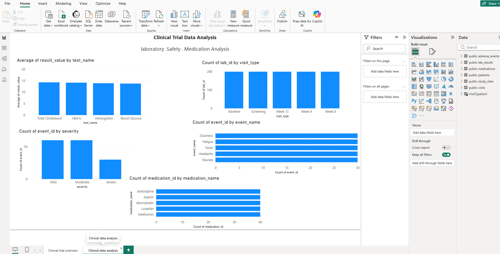

# Clinical Trial Data Management & Analysis

> Portfolio Project | Excel • PostgreSQL • SQL • Power BI • DAX

## Project Overview

This is an end-to-end clinical trial data management and analysis portfolio project.

Clinical-trial-style data was prepared in Excel, stored and managed in PostgreSQL, analyzed using SQL, and visualized through an interactive Power BI dashboard.

The project covers patient demographics, study sites, visits, laboratory results, medications, and adverse events.

> **Note:** This is a portfolio/learning project using structured clinical-trial-style data. It does not represent a real clinical trial or real patient records.

---
## Power BI Dashboard

### Page 1 — Clinical Trial Overview



### Page 2 — Clinical Data Analysis



## Project Objectives

- Prepare and structure clinical-trial-style data.
- Build a relational database in PostgreSQL.
- Perform data validation and analysis using SQL.
- Apply joins, aggregations, CASE statements, subqueries, CTEs, views, and window functions.
- Connect the database to Power BI.
- Build an interactive clinical-trial dashboard.
- Validate Power BI results against PostgreSQL source data.
- Generate meaningful clinical-trial reporting insights.

---

## Tools & Technologies

| Tool | Purpose |
|---|---|
| **Microsoft Excel** | Data preparation and source dataset creation |
| **PostgreSQL** | Relational database and data storage |
| **SQL** | Data querying, validation, and analysis |
| **Power BI** | Interactive dashboard and visualization |
| **DAX** | Power BI measures and KPI calculations |

---

# Database Structure

The project contains six core tables:

| Table | Purpose |
|---|---|
| `patients` | Patient demographics and enrollment information |
| `study_sites` | Clinical trial study-site information |
| `visits` | Patient visits, visit types, and visit status |
| `lab_results` | Laboratory test results |
| `medications` | Medication records |
| `adverse_events` | Adverse-event records and severity |

### Main Relationships

```text
study_sites
     │
     │ 1 : Many
     ▼
   visits

patients
   ├──────────► visits
   ├──────────► lab_results
   ├──────────► medications
   └──────────► adverse_events

